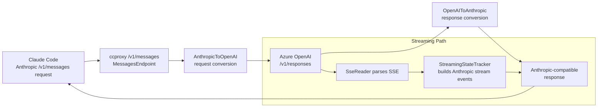

# CCProxy

A local proxy that enables Claude Code to use Azure-hosted OpenAI models. CCProxy translates between the Anthropic `/v1/messages` API and OpenAI's Responses API (`/v1/responses`), so Claude Code works seamlessly with models like GPT-5-Codex deployed on Azure.

## Prerequisites

- [.NET 10 SDK](https://dotnet.microsoft.com/download)
- An Azure OpenAI deployment with a Responses API-compatible model

## Configuration

CCProxy accepts configuration via command-line arguments or environment variables. CLI arguments take precedence.

| CLI Argument   | Environment Variable   | Description                                  | Default |
|----------------|------------------------|----------------------------------------------|---------|
| `--port`       | `CCPROXY_PORT`         | Local port to listen on                      | `5186`  |
| `--endpoint`   | `CCPROXY_ENDPOINT_URL` | Azure endpoint base URL                      | —       |
| `--model`      | `CCPROXY_MODEL`        | Target Azure model deployment name           | —       |
| `--key`        | `CCPROXY_API_KEY`      | Azure API key                                | —       |
| `--logfile`    | —                      | Path to verbose JSON log file (optional)     | —       |

## Quick Start

```bash
# Using CLI arguments
dotnet run --project src/ccproxy -- \
  --endpoint https://your-resource.openai.azure.com \
  --model gpt-5-codex \
  --key your-api-key

# Or using environment variables
export CCPROXY_ENDPOINT_URL=https://your-resource.openai.azure.com
export CCPROXY_MODEL=gpt-5-codex
export CCPROXY_API_KEY=your-api-key
dotnet run --project src/ccproxy
```

## Using with Claude Code

Point Claude Code at the proxy by setting the base URL:

```bash
export ANTHROPIC_BASE_URL=http://localhost:5186
```

Then use Claude Code as usual. The proxy transparently converts requests to the OpenAI Responses API format and responses back to Anthropic format. The model name from Claude Code is echoed back in responses so Claude Code remains unaware of the underlying model.

## How It Works



## Endpoints

### POST `/v1/messages`

Main proxy endpoint. Accepts Anthropic Messages API requests (both streaming and non-streaming), converts them to OpenAI Responses API format, forwards to Azure, and converts the response back.

### POST `/shutdown`

Gracefully shuts down the proxy. Returns `{"status":"shutting_down"}`.

## Diagnostics

Each request produces a concise 2-line summary on stderr:

```
[ccproxy] POST /v1/messages - 200
[ccproxy] gpt-5-codex -> 5 tools 2 messages
```

For full verbose logging (JSON payloads and SSE events), use `--logfile` to write diagnostics to a file:

```bash
dotnet run --project src/ccproxy -- \
  --endpoint https://your-resource.openai.azure.com \
  --model gpt-5-codex \
  --key your-api-key \
  --logfile debug.log
```

## API Conversion Reference

### Request Mapping (Anthropic → OpenAI)

| Anthropic Field        | OpenAI Responses API Field |
|------------------------|----------------------------|
| `model`                | Configured `--model` value |
| `system`               | `instructions`             |
| `messages`             | `input`                    |
| `max_tokens`           | `max_output_tokens`        |
| `temperature`, `top_p` | Pass through               |
| `tools`                | `tools` (function type)    |
| `tool_choice`          | `tool_choice`              |
| `stream`               | `stream`                   |

### Response Mapping (OpenAI → Anthropic)

| OpenAI Field                | Anthropic Field              |
|-----------------------------|------------------------------|
| `output[].message`          | `content[].text`             |
| `output[].function_call`    | `content[].tool_use`         |
| `status: "completed"`       | `stop_reason: "end_turn"`    |
| `status: "incomplete"`      | `stop_reason: "max_tokens"`  |
| Any function_call in output | `stop_reason: "tool_use"`    |
| `usage`                     | `usage` (direct mapping)     |

## Project Structure

```
ccproxy/
├── ccproxy.sln                         # Solution file
├── src/ccproxy/
│   ├── Program.cs                      # App bootstrap and DI wiring
│   ├── ccproxy.csproj                  # ASP.NET Core proxy project
│   ├── appsettings.json                # Default ASP.NET logging config
│   ├── Configuration/
│   │   └── ProxyConfig.cs              # CLI/env config parsing and validation
│   ├── Endpoints/
│   │   ├── MessagesEndpoint.cs         # /v1/messages handler
│   │   └── ShutdownEndpoint.cs         # /shutdown handler
│   ├── Conversion/
│   │   ├── AnthropicToOpenAI.cs        # Anthropic -> OpenAI request mapping
│   │   ├── OpenAIToAnthropic.cs        # OpenAI -> Anthropic response mapping
│   │   └── StreamingStateTracker.cs    # Streaming event state machine
│   ├── Proxy/
│   │   ├── OpenAIProxy.cs              # Azure Responses API client
│   │   └── SseReader.cs                # SSE stream parser
│   ├── Diagnostics/
│   │   └── Logger.cs                   # Stderr summaries + optional file logging
│   └── Properties/
│       └── launchSettings.json         # Local launch profile
├── tests/ccproxy.Tests/
│   ├── ccproxy.Tests.csproj            # xUnit test project
│   ├── GlobalUsings.cs                 # Shared test usings
│   ├── EndToEndTests.cs                # End-to-end endpoint and streaming tests
│   └── Conversion/
│       ├── AnthropicToOpenAITests.cs
│       ├── OpenAIToAnthropicTests.cs
│       └── StreamingStateTrackerTests.cs
└── docs/
    └── PRD.md                          # Product requirements
```

## Testing

```bash
# Run all tests
dotnet test

# Manual non-streaming test
curl -X POST http://localhost:5186/v1/messages \
  -H "Content-Type: application/json" \
  -d '{"model":"claude-sonnet-4-20250514","max_tokens":100,"messages":[{"role":"user","content":"Say hello"}]}'

# Manual streaming test
curl -X POST http://localhost:5186/v1/messages --no-buffer \
  -H "Content-Type: application/json" \
  -d '{"model":"claude-sonnet-4-20250514","max_tokens":100,"stream":true,"messages":[{"role":"user","content":"Say hello"}]}'
```

## License

See [LICENSE](LICENSE).
